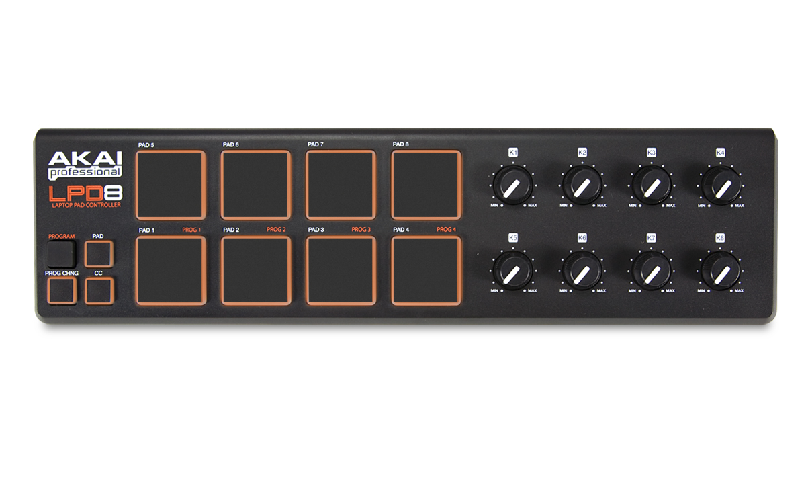

akai-lpd8
==========


> The Akai LPD8 is a nice yet not too pricey USB MIDI controller, providing 8 pads and 8 knobs.

**akai-lpd8** is an npm package for using **Web MIDI** with such a MIDI controller offering a simple interface to access each pads and knobs:
```bash
npm i akai-lpd8
```

```js
const AkaiLPD8 = require('akai-lpd8')
// or include <script src="https://unpkg.com/akai-lpd8@1.0.1/dist/AkaiLPD8.min.js"></script>

const LPD8 = new AkaiLPD8()

LPD8.init()
    .then(() => {
        console.log(LPD8)
        LPD8.K1.on('change', vel => console.log({vel}))
        LPD8.PAD5.noteOn(vel => console.log({vel}))
    })
    .catch(error => console.error({ error }))
```

Optionally, you can pass an object with a `log` property to get logs in the console
```js
const LPD8 = new AkaiLPD8({log: true})
```

Once initialized, we can access our controls using their names:
```js
console.log(LPD8.K1.type, LPD8.K2.command)
background(LPD8.K3.velocity, LPD8.PAD1.velocity, LPD8.PAD2.velocity)
```

And use events:
```js
LPD8.K4.on('change', velocity => console.log(velocity))
```
> Events callback are passed *velocity* as argument.

Valid events are:
- **change**: fired when a control sends a new message. (*for all controls*)
- **noteOn**: fired when a pad fires a *noteOn* message. (*for pads only*)
- **noteOff**: fired when a pad fires a *noteOff* message. (*for pads only*)

You can also use shorthands:
```js
LPD8.K5.change(velocity => console.log(velocity))
LPD8.PAD3.noteOn(velocity => console.log(velocity))
LPD8.PAD4.noteOff(velocity => console.log(velocity))
```
> `noteOn` and `noteOff` methods are **only available for pads**.


### Todo for use of multiple LPD8:
- AkaiLPD8 class should extend MIDIInput
- use of static method to find LPD8 devices
- constructor could take a MIDIInput as argument
